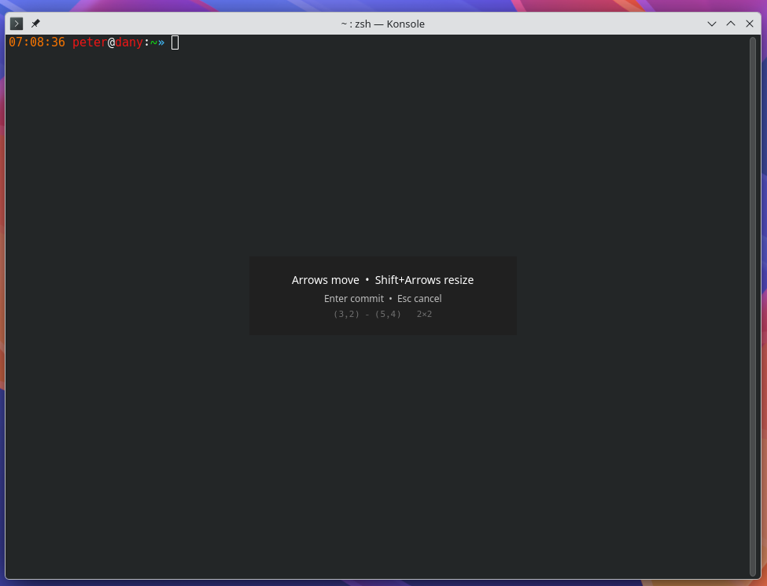

# GridTilio

A grid-based window tiling overlay for KDE Plasma 6 / KWin, modeled on
GNOME Shell's [gTile](https://github.com/gTile/gTile) keyboard mode.

Press one shortcut. Use arrow keys. Place windows on a virtual 8×6 grid.



## What it does

1. Press **`Meta+Return`** on any window.
2. A small overlay appears and grabs keyboard focus.
3. Arrow keys move the window one cell in that direction, preserving size.
   If the leading edge is already at the screen edge, the trailing edge
   moves instead — so a too-wide window scrunches into the right side
   when you keep pressing Right, instead of stalling.
4. **`Shift`+Arrow** moves the **bottom-right** corner (i.e. resize, anchored
   at the top-left).
5. **`Enter`** commits the new placement. **`Esc`** restores the original
   geometry.

The window snaps to grid cells when the overlay opens and animates smoothly
(120 ms, OutCubic) for every subsequent move or resize. On multi-monitor
setups the grid is sized to the available work area of whichever screen
the target window is on — panels, docks and reserved space are excluded so
windows aren't placed under them.

## Requirements

- KDE Plasma 6.0 or newer (tested on 6.5.6)
- Wayland (X11 not tested; should work since the script uses no
  Wayland-specific APIs)

## Install

### From source (today)

```bash
git clone <repo-url> gridtilio
cd gridtilio
make install
```

This builds `gridtilio.kwinscript`, installs it via `kpackagetool6`,
enables it in `kwinrc`, and asks KWin to reread its config. The Makefile
also supports `make update` (same as install — auto-upgrades), `make
uninstall`, `make build` (just produce the archive), and `make
reconfigure`.

Press **`Meta+Return`** on any window to use.

### Via System Settings GUI (once a release is published)

Plasma's standard install flow for KWin scripts works once a
`gridtilio.kwinscript` archive is available:

1. **Build the archive** (`make build`) — or, in future, download it from
   the [Releases page](#).
2. Open **System Settings → Window Management → KWin Scripts**.
3. Click **"Install From File…"** and select the `.kwinscript`.
4. Tick the **GridTilio** checkbox and click **Apply**.

When the project is on the [KDE Store](https://store.kde.org/), it'll also
be reachable via the same dialog's **"Get New KWin Scripts…"** button — no
manual download.

## Configuration

**Rebind the shortcut**: System Settings → Shortcuts → KWin → search for
*"GridTilio: Open overlay"*. Pick any key combination you like.

**Change the grid size** (currently hardcoded as 8 columns × 6 rows, matching
gTile's primary default): edit `gridCols` and `gridRows` at the top of
`contents/ui/main.qml`, then update the package (`kpackagetool6 -u .`) and
log out / back in for the change to take effect. A config-UI for this is
on the wish-list.

## Limitations and possible future work

GridTilio is deliberately minimal. A few things it does **not** do today
that similar projects (notably gTile on GNOME) offer:

- **Mouse selection inside the overlay.** Click-and-drag on a miniature
  grid to set the two corners. Technically straightforward — the overlay
  is already a QML window and a `MouseArea` over a small grid preview is
  ~60–80 lines of QML on top of what's there. Just not implemented yet.
- **Panel / system-tray button to open the overlay.** Requires a separate
  Plasma 6 plasmoid (panel widget) package that D-Bus-calls into this
  script. Meaningful effort — KZones, Polonium and Bismuth all ship a
  script + companion plasmoid pair for exactly this reason.
- **Multiple grid sizes** cycled via hotkey. gTile ships three presets
  (`8×6`, `6×4`, `4×4`). Small individual change but requires config
  plumbing.
- **Per-window remembered placements** that survive close/reopen.
- **Gaps / gutters** between cells.

If any of these become "I really want this", open an issue. None are hard
individually; together they would change the product's character.

## Related

- **[gTile](https://github.com/gTile/gTile)** — the GNOME Shell original. Has
  a richer set of features (presets, mouse-resize, gaps, …). GridTilio
  implements only its keyboard-mode core today.
- **[Grid-Tiling-Kwin](https://github.com/lingtjien/Grid-Tiling-Kwin)** —
  different model: auto-tiles all windows on a grid, no modal overlay.
- **[MouseTiler](https://github.com/rxappdev/MouseTiler)** — mouse-driven
  KWin tiler.
- **[FlexGrid](https://github.com/Hegemonia123/FlexGrid)** — preset layouts
  (3×3, 4×3, …) without a modal overlay.

## Development

See [DEVELOPMENT.md](DEVELOPMENT.md) for project layout, the hot-reload
workflow that lets you iterate on the QML without logging out, and the
KWin/kglobalaccel gotchas hit during initial development.

## License

MIT
